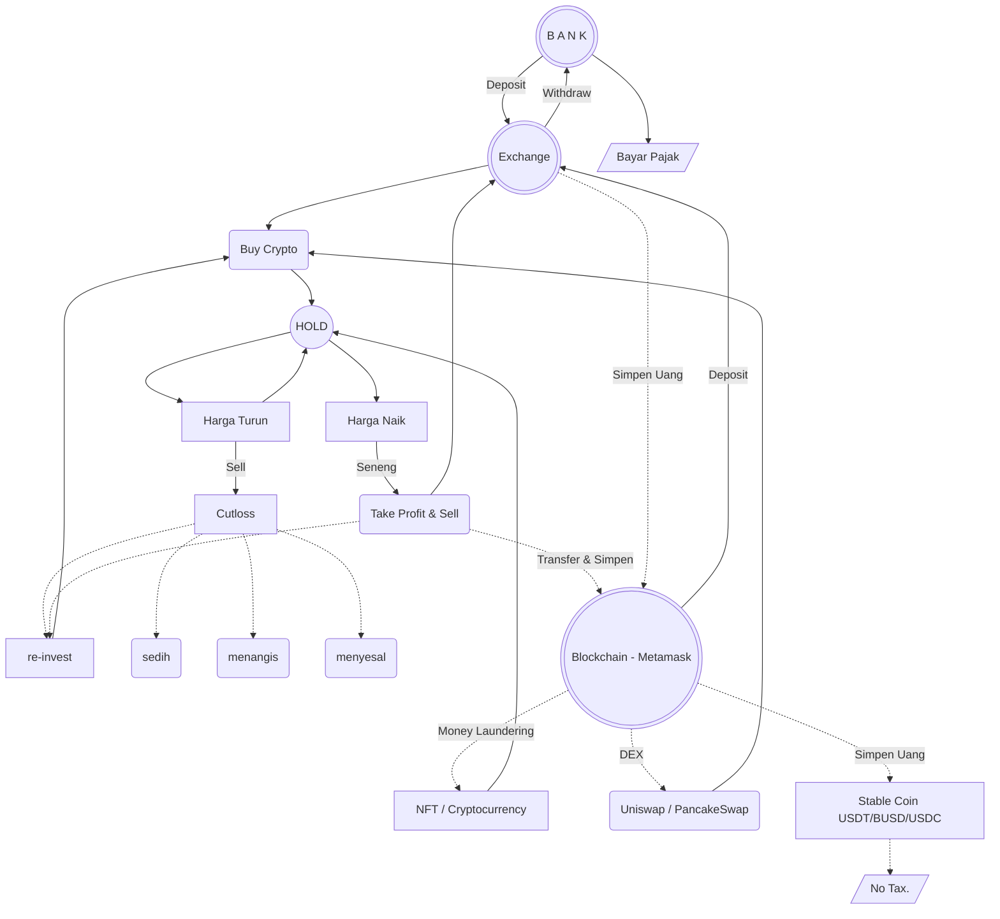

+++
author = "Alvernood"
title = 'Cryptocurrency Flowchart'
date = 2023-03-10T06:23:01+07:00
draft = false
description = ''
tags = ['crypto']
categories = ['']
diagram = true
math = false
_build = {list = "always"}
cascade = {_build = {list = "always"}}
+++

#### Interesting Cryptocurrency Flowchart

